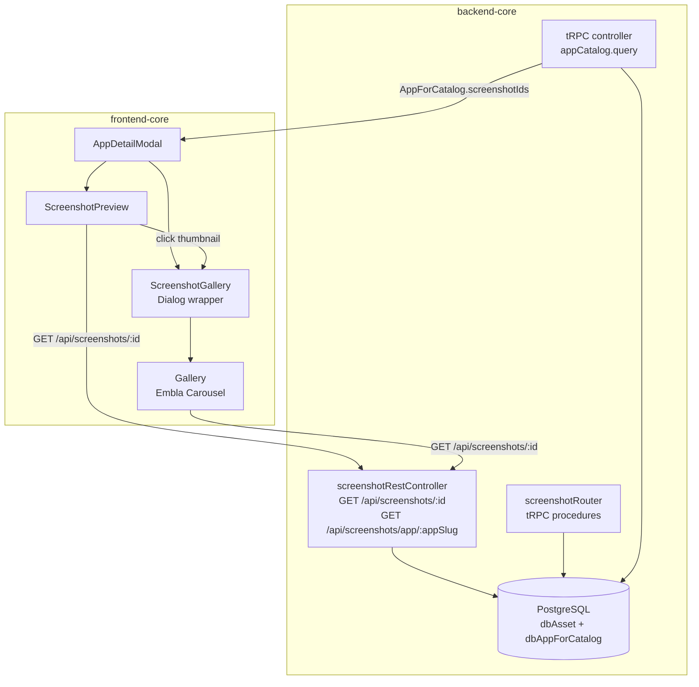

# Design Document: Screenshot Gallery

## Overview

The Screenshot Gallery feature provides a way for users to view application screenshots within the App Catalog. It consists of three layers:

1. **Screenshot_Preview** — a vertical list of thumbnail images inside the `AppDetailModal`, loaded directly from the REST endpoint.
2. **Gallery** — an Embla Carousel-based component with peek effect, navigation controls, keyboard/wheel support, and a fullscreen view.
3. **Gallery_Dialog** — a Radix UI `Dialog` wrapper (`ScreenshotGallery`) that hosts the `Gallery` in a modal overlay.

The feature is largely implemented. This document captures the current architecture, identifies gaps against the requirements, and defines correctness properties for testing.

### Gaps Identified

| Gap                                                                           | Requirement   | Description                                                                                                                                                                                                                                                                  |
| ----------------------------------------------------------------------------- | ------------- | ---------------------------------------------------------------------------------------------------------------------------------------------------------------------------------------------------------------------------------------------------------------------------- |
| No `screenshotIds` ordering guarantee in `getByAppSlug` tRPC query            | 10.1, 10.2    | `findMany` with `id: { in: [...] }` does not preserve array order in PostgreSQL                                                                                                                                                                                              |
| `ScreenshotPreview` thumbnails lack explicit `width` attribute                | 1.1           | Images use `max-h-[600px]` but no `size` query param for thumbnail optimization                                                                                                                                                                                              |
| `getByAppSlug` REST endpoint does not return results in `screenshotIds` order | 10.1          | Results are returned in DB insertion order, not the app's `screenshotIds` array order                                                                                                                                                                                        |
| Escape key does not follow layered dismissal order                            | 6.3, 6.5, 6.7 | Radix Dialog intercepts Escape and closes the Gallery_Dialog directly, bypassing the Fullscreen_View → Gallery_Dialog → App_Card layering. The `Gallery` component must intercept Escape in fullscreen mode and call `stopPropagation()` to prevent the dialog from closing. |

> **Note:** Screenshots are populated exclusively via backend seeding. The `screenshotIds` array and its ordering are defined at seed time. There is no admin UI for uploading or reordering screenshots.

---

## Architecture



The `screenshotIds` array on `AppForCatalog` is the single source of truth for which screenshots belong to an app and in what order. It is fetched once via the `appCatalog.query` tRPC call and passed down through props. Individual image binaries are fetched lazily by the browser via ``.

> **No looping:** Embla Carousel must be initialized with `loop: false`. Navigation buttons and arrow key handlers must be disabled/no-op at the first and last index respectively.

---

## Components and Interfaces

### `ScreenshotPreview` (inside `AppDetailModal.tsx`)

Renders a vertical list of clickable thumbnail images. Manages its own `imageErrors` set and `galleryOpen`/`initialIndex` state.

```typescript
// Props (implicit — receives app: AppForCatalog)
interface ScreenshotPreviewProps {
  app: AppForCatalog // app.screenshotIds drives the list
}
```

Key behaviors:

- Maps `screenshotIds` to `` elements
- Hides images that fail to load via `onError` → adds to `imageErrors` set
- Opens `ScreenshotGallery` with the clicked index on click or Enter/Space keydown

### `ScreenshotGallery` (`ui/components/ScreenshotGallery.tsx`)

Thin wrapper that converts `screenshotIds` to `GalleryImage[]` and renders a Radix `Dialog` containing `Gallery`.

```typescript
export interface ScreenshotGalleryProps {
  app: AppForCatalog
  screenshotIds: Array<string>
  initialIndex?: number
  open: boolean
  onOpenChange: (open: boolean) => void
  title?: string
}
```

Dialog sizing: `h-[85vh] w-full max-w-[calc(100vw-2rem)]` (up to `calc(100vw-4rem)` on larger breakpoints).

### `Gallery` (`modules/gallery/Gallery.tsx`)

The core carousel component. Self-contained — no external state dependencies.

```typescript
export interface GalleryImage {
  url: string
  alt: string
}

export interface GalleryProps {
  images: Array<GalleryImage>
  initialIndex?: number
  onIndexChange?: (index: number) => void
  className?: string
  title?: string
}
```

Internal state:

- `currentIndex` — synced with Embla's `selectedScrollSnap`
- `isFullscreen` — toggles the fullscreen overlay
- `imageStates` — `Record<number, 'loading' | 'loaded' | 'error'>`, reset when `images` changes

#### Layered Escape Handling

The `Gallery` component must intercept `Escape` keydown events when `isFullscreen` is `true` and call `event.stopPropagation()` before setting `isFullscreen = false`. This prevents the Radix `Dialog` (which also listens for Escape) from closing the `Gallery_Dialog` at the same time.

The resulting dismissal chain on repeated Escape presses:

1. `isFullscreen = true` → exits fullscreen, stays in gallery (event consumed)
2. `isFullscreen = false`, gallery open → Radix Dialog closes `Gallery_Dialog`, App_Card stays open
3. App_Card open → App_Card closes

### Backend: `screenshotRestController`

| Endpoint                                  | Description                                                                                                                     |
| ----------------------------------------- | ------------------------------------------------------------------------------------------------------------------------------- |
| `GET /api/screenshots/:id`                | Returns binary image. Accepts `?size=N` to resize to NxN (fit inside, no enlarge). Sets `Cache-Control: public, max-age=86400`. |
| `GET /api/screenshots/app/:appSlug`       | Returns JSON array of screenshot metadata in DB order (gap: not ordered by `screenshotIds`).                                    |
| `GET /api/screenshots/app/:appSlug/first` | Returns metadata for the first screenshot in `screenshotIds[0]`.                                                                |
| `GET /api/screenshots/:id/metadata`       | Returns metadata only (no binary).                                                                                              |

### Backend: `screenshotRouter` (tRPC)

Provides `list`, `getOne`, `getByAppSlug`, `getFirstByAppSlug` procedures. These are metadata-only — no binary content. Used by internal tooling.

> **Note on ordering:** The `screenshotIds` array on `AppForCatalog` is populated and ordered at seed time. There is no mutation to update this order at runtime — the seed is the single source of truth for screenshot ordering.

---

## Data Models

### `AppForCatalog` (shared type)

```typescript
interface AppForCatalog {
  id: string
  slug: string
  displayName: string
  screenshotIds?: Array<string> // Ordered array of dbAsset IDs
  // ... other fields
}
```

### `dbAsset` (Prisma model)

```typescript
// Relevant fields for screenshots
{
  id: string          // UUID, used as screenshot ID in URLs
  name: string        // Unique asset name
  assetType: 'screenshot' | 'icon' | ...
  content: Bytes      // Binary image data
  mimeType: string    // e.g. 'image/png'
  fileSize: number
  width?: number
  height?: number
  checksum: string    // SHA-256 of content
  createdAt: DateTime
}
```

### `GalleryImage` (frontend)

```typescript
interface GalleryImage {
  url: string // /api/screenshots/:id
  alt: string // "{appName} screenshot"
}
```

### Image Loading State

```typescript
type ImageLoadState = 'loading' | 'loaded' | 'error'
// Stored as Record<number, ImageLoadState> keyed by slide index
```

---

## Correctness Properties

_A property is a characteristic or behavior that should hold true across all valid executions of a system — essentially, a formal statement about what the system should do. Properties serve as the bridge between human-readable specifications and machine-verifiable correctness guarantees._

### Property 1: Thumbnail count matches screenshotIds

_For any_ app with N screenshot IDs (N ≥ 1), the `ScreenshotPreview` component should render exactly N thumbnail `` elements (before any load errors).

**Validates: Requirements 1.1, 1.3**

---

### Property 2: Thumbnail src URLs match screenshotIds

_For any_ array of screenshot IDs, each rendered thumbnail's `src` attribute should equal `/api/screenshots/{id}` for the corresponding ID at the same index.

**Validates: Requirements 1.3, 10.1**

---

### Property 3: Failed thumbnails are hidden, others remain

_For any_ set of screenshot IDs where a subset fails to load, the thumbnails that failed should not be rendered, and all other thumbnails should still be visible.

**Validates: Requirements 1.4**

---

### Property 4: Clicking thumbnail opens gallery at correct index

_For any_ screenshot list and any index i, clicking the thumbnail at position i should open the `ScreenshotGallery` with `initialIndex = i`.

**Validates: Requirements 2.1, 2.4**

---

### Property 5: Keyboard activation opens gallery at correct index

_For any_ screenshot list and any index i, pressing Enter or Space while the thumbnail at position i is focused should open the `ScreenshotGallery` with `initialIndex = i`.

**Validates: Requirements 2.2, 6.4**

---

### Property 6: Navigation buttons clamp at boundaries

_For any_ gallery with N > 1 images at current index i, clicking the next button should advance to index i+1 if i < N-1, and should be disabled (no-op) at i = N-1. Clicking the previous button should go to i-1 if i > 0, and should be disabled (no-op) at i = 0. The carousel SHALL NOT wrap around.

**Validates: Requirements 3.2, 3.3, 3.4, 3.5**

---

### Property 7: Counter text reflects current state

_For any_ gallery with N images at current index i, the counter element should display the text `"{i+1} / {N}"`.

**Validates: Requirements 3.7, 3.8**

---

### Property 8: Wheel scroll direction maps to navigation direction

_For any_ gallery with N > 1 images, a wheel event with positive delta (down/right) should advance to the next slide, and a wheel event with negative delta (up/left) should go to the previous slide.

**Validates: Requirements 4.1, 4.2**

---

### Property 9: Wheel scroll debounce prevents rapid transitions

_For any_ gallery, firing multiple wheel events within 300ms should result in only one slide transition.

**Validates: Requirements 4.4**

---

### Property 10: Peek effect — slide width by image count

_For any_ gallery with N > 1 images, each slide's `flexBasis` style should be `"85%"`. For a gallery with exactly 1 image, the slide's `flexBasis` should be `"100%"`.

**Validates: Requirements 5.1, 5.2**

---

### Property 11: Non-active slides have reduced opacity

_For any_ gallery with N > 1 images at current index i, all slides where index ≠ i should have the `opacity-40` CSS class applied.

**Validates: Requirements 5.3**

---

### Property 12: Arrow key navigation clamps at boundaries

_For any_ gallery with N > 1 images, pressing ArrowRight should advance the index by 1 unless already at N-1 (no-op). Pressing ArrowLeft should decrement the index by 1 unless already at 0 (no-op). No wrapping.

**Validates: Requirements 6.1, 6.2, 6.8, 6.9**

---

### Property 13: Clicking active slide enters fullscreen

_For any_ gallery, clicking the currently active slide image should set `isFullscreen = true` and render the fullscreen overlay.

**Validates: Requirements 7.1**

---

### Property 14: Fullscreen loading and error states

_For any_ gallery in fullscreen mode, if the current image state is `'loading'`, a spinner should be visible. If the state is `'error'`, the error UI (icon + message) should be visible. If the state is `'loaded'`, the image should be visible.

**Validates: Requirements 7.4, 7.5**

---

### Property 15: Carousel image loading states

_For any_ gallery, each slide should display a spinner when its image state is `'loading'`, the image when `'loaded'`, and an error UI when `'error'`.

**Validates: Requirements 8.1, 8.2, 8.3**

---

### Property 16: Image states reset when images array changes

_For any_ gallery where some images have been loaded or errored, replacing the `images` prop with a new array should reset all image states to `'loading'`.

**Validates: Requirements 8.4**

---

### Property 17: Screenshot endpoint returns correct Content-Type

_For any_ screenshot asset stored in the database, a `GET /api/screenshots/:id` request should return a response with `Content-Type` matching the asset's `mimeType` and `Cache-Control: public, max-age=86400`.

**Validates: Requirements 9.1, 9.4**

---

### Property 18: Screenshot resize fits within requested square

_For any_ screenshot and any positive integer `size`, a `GET /api/screenshots/:id?size={size}` request should return an image where both width and height are ≤ `size`.

**Validates: Requirements 9.2**

---

### Property 19: App screenshots metadata preserves screenshotIds order

_For any_ app with a `screenshotIds` array, the `GET /api/screenshots/app/:appSlug` endpoint should return metadata objects in the same order as `screenshotIds`.

**Validates: Requirements 9.5, 10.1, 10.2**

---

## Error Handling

### Frontend

- **Thumbnail load failure**: `onError` on the `` adds the ID to `imageErrors` set; the element returns `null` on next render. Other thumbnails are unaffected.
- **Carousel image load failure**: `imageStates[index]` is set to `'error'`; the slide renders an `<ImageOff>` icon and "Failed to load" text.
- **Fullscreen image load failure**: Same state machine — renders `<ImageOff>` icon and "Failed to load image" text.
- **Empty screenshots**: `ScreenshotPreview` renders a placeholder div. `ScreenshotGallery` returns `null` if `screenshotIds.length === 0`.

### Backend

- **Screenshot not found** (`GET /api/screenshots/:id`): Returns `404 { error: 'Screenshot not found' }`.
- **App not found** (`GET /api/screenshots/app/:appSlug`): Returns `404 { error: 'App not found' }`.
- **Resize failure**: Falls back to original image content; logs the error.
- **Database errors**: Caught and returned as `500 { error: '...' }`.

---

## Testing Strategy

### Dual Testing Approach

Both unit tests and property-based tests are required. Unit tests cover specific examples, edge cases, and integration points. Property-based tests verify universal behaviors across many generated inputs.

### Property-Based Testing

Use **fast-check** for property-based tests in both `frontend-core` and `backend-core`.

Each property test must run a minimum of 100 iterations. Tag each test with a comment referencing the design property:

```typescript
// Feature: screenshot-gallery, Property 1: Thumbnail count matches screenshotIds
```

**Frontend property tests** (`packages/frontend-core/src/__tests__/`):

- Properties 1–5: `ScreenshotPreview` rendering — use `@testing-library/react` + `fast-check` to generate random `screenshotIds` arrays and assert rendered output
- Properties 6–12: `Gallery` navigation — render with generated image arrays, simulate user events, assert state changes
- Properties 10–11: Peek effect and opacity — render with generated image counts, assert CSS classes/styles
- Properties 13–16: Fullscreen and loading states — render with controlled `imageStates`, assert UI output

**Backend property tests** (`packages/backend-core/src/__tests__/`):

- Properties 17–18: Screenshot endpoint — use MSW or direct handler testing with generated screenshot data
- Property 19: Ordering — generate random `screenshotIds` arrays, verify response order matches

### Unit Tests

Focus on:

- **Empty state** (Req 1.2): `ScreenshotPreview` with `screenshotIds = []` renders placeholder
- **Single image** (Req 3.6, 5.2, 6.6): Gallery with 1 image disables buttons, uses 100% width, ignores arrow keys and wheel
- **Dialog sizing** (Req 2.3): `ScreenshotGallery` dialog content has correct CSS classes
- **Escape closes dialog** (Req 6.3): Radix Dialog handles Escape natively; verify `onOpenChange(false)` is called
- **Escape exits fullscreen** (Req 6.5, 7.7): Simulate Escape in fullscreen state, verify `isFullscreen` becomes false
- **Wheel preventDefault** (Req 4.3): Simulate wheel event, verify `event.preventDefault()` was called
- **404 responses** (Req 9.3, 9.6): Request non-existent IDs/slugs, verify 404 status
- **Close button exits fullscreen** (Req 7.6): Click close button in fullscreen, verify carousel view is restored

### Property-Based Test Configuration

```typescript
import fc from 'fast-check'

// Minimum 100 runs per property
fc.assert(fc.property(...), { numRuns: 100 })
```

Each correctness property must be implemented by a single property-based test. Unit tests handle the specific examples and edge cases listed above.
